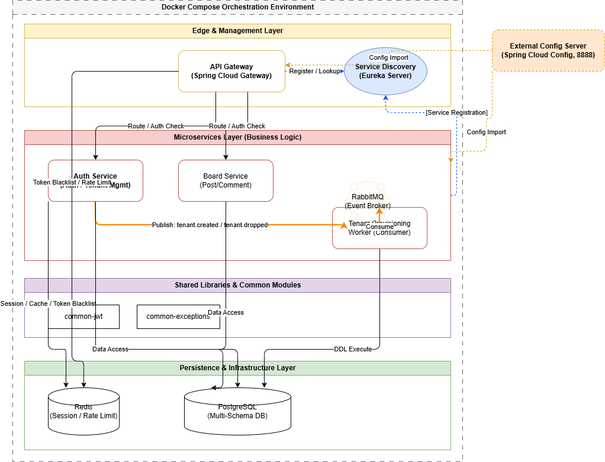

# SaaS 기반 멀티테넌트 HR 플랫폼 백엔드 아키텍처

## 1. 프로젝트 개요

이 프로젝트는 기존 ERP/HR 업무 시스템 개발 경험을 바탕으로, 여러 고객사가 하나의 플랫폼을 사용하는 **SaaS형 HR 시스템**을 가정하고 설계한 백엔드 중심 개인 프로젝트입니다.

Spring Cloud 기반의 마이크로서비스 아키텍처를 구성하고, 인증/인가, 테넌트 관리, 서비스 디스커버리, API Gateway, 메시지 브로커 기반 비동기 처리, 테넌트별 스키마 프로비저닝을 직접 구현하거나 단계적으로 확장하는 것을 목표로 합니다.

> 목적: 단순 CRUD 기능 구현을 넘어, SaaS 환경에서 필요한 멀티테넌시, 인증/인가, 서비스 분리, 이벤트 기반 처리 구조를 학습하고 포트폴리오로 정리하는 것

---

## 2. 개발 배경

기존 ERP/HR 시스템은 단일 고객사 또는 특정 업무 환경에 맞춰 구축되는 경우가 많습니다. 본 프로젝트에서는 이러한 업무 시스템 경험을 확장하여, 여러 고객사가 하나의 플랫폼을 공유하는 SaaS 구조를 가정했습니다.

특히 HR 도메인 특성상 고객사별 데이터 격리, 사용자 권한, 모듈 접근 제어, 운영 추적성이 중요하다고 판단했으며, 이를 MSA 구조와 멀티테넌시 전략으로 설계해보고자 했습니다.

---

## 3. 핵심 구현 범위

### 3.0 아키텍처 구조도


### 3.1 인증 및 보안

- 회원가입, 로그인, 로그아웃 기능 구현
- JWT Access Token / Refresh Token 발급 및 검증
- Redis 기반 Access Token 블랙리스트 처리
- Spring Security 기반 인증 흐름 구성
- API Gateway에서 요청 인증 및 내부 서비스 라우팅 처리

### 3.2 멀티테넌시

- SaaS 고객사 단위의 테넌트 개념 도입
- 테넌트 생성 API 구현
- 테넌트별 데이터 격리를 위한 Schema-per-Tenant 전략 적용
- 신규 테넌트 생성 시 별도 스키마를 생성하는 프로비저닝 구조 구현

### 3.3 이벤트 기반 프로비저닝

- 테넌트 생성과 스키마 생성 책임 분리
- Auth Service에서 TenantCreated 이벤트 발행
- RabbitMQ를 통해 이벤트 전달
- Tenant Provisioning Worker에서 이벤트 수신 후 PostgreSQL 스키마 생성

### 3.4 인프라 구성

- Eureka 기반 Service Discovery 구성
- Spring Cloud Gateway 기반 API Gateway 구성
- Spring Cloud Config Server를 통한 설정 중앙화
- PostgreSQL, Redis, RabbitMQ 등 인프라 서비스를 Docker Compose로 구성
- 서비스별 독립 실행 및 컨테이너 기반 실행 환경 정리

---

## 4. 기술 스택

### Backend

- Java 17
- Spring Boot 3.x
- Spring Security
- Spring Data JPA
- QueryDSL
- Spring Cloud Gateway
- Spring Cloud Netflix Eureka
- Spring Cloud Config

### Database / Cache / Messaging

- PostgreSQL
- Redis
- RabbitMQ

### Infra / DevOps

- Docker
- Docker Compose
- Gradle Multi-Module

---

## 5. 프로젝트 구조

```text
micro-service (Root)
├── common-exceptions/            # 공통 예외 클래스 및 표준 응답 규격
├── common-jwt/                   # JWT 생성/검증 로직 및 보안 유틸리티
├── service-discovery/            # Eureka Server
├── config-server/                # Spring Cloud Config Server
├── api-gateway/                  # API Gateway 및 인증 필터
├── auth-service/                 # 인증, 사용자, 테넌트 관리
├── board-service/                # 샘플 업무 서비스 또는 확장 대상 서비스
└── tenant-provisioning-worker/   # 테넌트 스키마 자동 생성 Worker
```

> 현재 서비스명은 학습 및 확장 과정에서 일부 변경될 수 있으며, 최종적으로는 HR 도메인 서비스와 모듈 권한 관리 구조로 확장하는 것을 목표로 합니다.

---

## 6. 주요 설계 포인트

### 6.1 Multi-Tenancy Strategy

초기에는 `shared schema + tenant_id` 방식을 고려했으나, 고객사별 데이터 격리와 SaaS 운영 관점의 명확성을 고려하여 `Schema-per-Tenant` 방식을 적용했습니다.

이 방식은 고객사별 데이터 격리와 백업/마이그레이션 단위 분리에 장점이 있지만, 테넌트 수가 증가할수록 스키마 관리와 마이그레이션 복잡도가 커질 수 있습니다. 따라서 본 프로젝트에서는 B2B SaaS 환경에서 데이터 격리가 중요한 경우를 가정하여 적용했습니다.

### 6.2 Event-Driven Provisioning

테넌트 생성 API와 스키마 생성 작업을 직접 결합하지 않고, RabbitMQ 이벤트를 통해 비동기적으로 분리했습니다.

이를 통해 테넌트 생성 이후 발생하는 후속 작업을 독립적으로 처리할 수 있으며, 향후 초기 데이터 생성, 모듈 활성화, 알림 발송, Audit Log 기록 등으로 확장할 수 있습니다.

### 6.3 Authentication Flow

Access Token은 클라이언트 요청 인증에 사용하고, Refresh Token은 토큰 재발급에 사용합니다. 로그아웃 시에는 Access Token을 Redis 블랙리스트에 저장하여 만료 전 재사용을 방지합니다.

API Gateway는 외부 요청의 단일 진입점으로 동작하며, 인증이 필요한 요청에 대해 JWT 검증 후 내부 서비스로 라우팅합니다.

### 6.4 Gradle Multi-Module Structure

공통 예외 처리, JWT 유틸리티 등 여러 서비스에서 재사용되는 코드는 공통 모듈로 분리했습니다. 이를 통해 중복 코드를 줄이고, 서비스 간 경계를 유지하면서도 공통 기능을 일관성 있게 관리할 수 있도록 구성했습니다.

---

## 7. 실행 방법

### 7.1 사전 요구 사항

- Java 17 이상
- Docker / Docker Desktop
- Gradle Wrapper 사용 권장

### 7.2 빌드 및 실행

```bash
# 전체 프로젝트 빌드
./gradlew clean build -x test

# Docker Compose 실행
docker-compose up -d --build
```

### 7.3 주요 접속 정보

```text
Eureka Dashboard: http://localhost:8761
API Gateway:      http://localhost:8080
RabbitMQ UI:      http://localhost:15672
```

> 포트 및 서비스 구성은 로컬 개발 환경의 docker-compose 설정에 따라 달라질 수 있습니다.

---

## 8. 트러블슈팅 및 학습 내용

### 8.1 QueryDSL QClass 생성 문제

Spring Boot 3.x 및 Jakarta 패키지 환경에서 QueryDSL QClass 생성 설정을 맞추는 과정에서 annotationProcessor 의존성, generated source 경로, Gradle 빌드 설정을 점검했습니다.

### 8.2 Spring Security + Gateway WebFlux 필터 구성

Spring Cloud Gateway가 WebFlux 기반으로 동작하기 때문에, 일반 Servlet 기반 Security Filter와 다른 방식으로 인증 필터를 구성해야 했습니다. 이를 통해 Gateway 레벨 인증과 서비스 내부 인증 책임의 경계를 정리했습니다.

### 8.3 RabbitMQ 이벤트 발행과 트랜잭션 경계

테넌트 저장과 이벤트 발행이 함께 수행될 때, DB 트랜잭션 성공 여부와 메시지 발행 시점 사이의 정합성 문제가 발생할 수 있음을 확인했습니다. 향후 Outbox Pattern, 재시도 큐, DLQ, Saga 패턴을 추가로 검토할 계획입니다.

---

## 9. 향후 개선 계획

- RBAC 기반 사용자·역할·권한 체계 고도화
- 메뉴/모듈 단위 접근 제어 구조 보강
- HR 도메인 서비스 분리 및 인사·휴가·결재 기능 확장
- Outbox Pattern 및 DLQ 기반 이벤트 처리 안정성 강화
- 자주 조회되는 데이터에 대한 Redis Cache 적용
- JPA 성능 개선 포인트 정리
    - N+1 문제
    - Fetch Join
    - DTO Projection
    - QueryDSL 기반 동적 조회
    - 페이징 최적화
- Audit Log 기능 추가
- Prometheus, Grafana, Loki, Tempo 등을 활용한 Observability 구성
- OpenAPI 제공을 위한 별도 API 서버 또는 API Key 기반 인증 구조 검토
- Docker Compose 기반 로컬 실행 환경 안정화 후 Kubernetes 확장 검토

---

## 10. 포트폴리오 관점의 의의

이 프로젝트는 완성된 상용 서비스를 목표로 하기보다, 기존 ERP/HR 업무 시스템 개발 경험을 SaaS/MSA 구조로 확장해보기 위한 학습 및 포트폴리오 프로젝트입니다.

특히 다음 역량을 보여주는 것을 목표로 합니다.

- 업무 시스템 도메인 이해를 바탕으로 한 백엔드 구조 설계
- 인증/인가 및 멀티테넌시 구조에 대한 이해
- Spring Cloud 기반 MSA 구성 경험
- RabbitMQ 기반 비동기 이벤트 처리 경험
- Redis, PostgreSQL, Docker Compose 등 인프라 구성 경험
- 단순 기능 구현을 넘어 운영, 장애 대응, 확장성을 고려한 설계 사고
