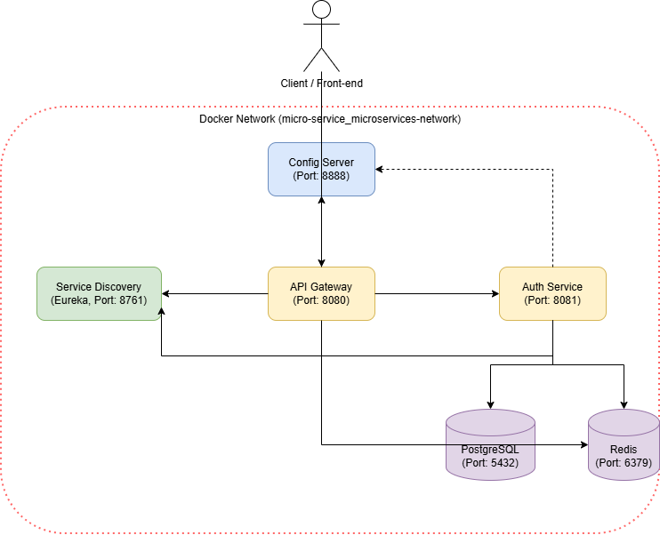

# [Tech Note] Spring Cloud MSA: 로컬 환경에서 Docker Compose 통합 환경으로의 전환 및 트러블슈팅

## 1. 개요 및 배경
기존 로컬 환경(H2 인메모리 DB, Local Redis)에서 개별적으로 빌드하고 실행하던 마이크로서비스들(API Gateway, Auth Service, Service Discovery)을 **Docker Compose**를 활용하여 하나의 가상 네트워크(`microservices-network`)로 묶어 통합 컨테이너 환경으로 마이그레이션했습니다.

가장 중요한 포인트는 **기존에 독립된 도커 컨테이너로 실행 중이던 `Config Server`와의 연동**입니다. 로컬과 도커 환경 모두 동일한 인증 방식과 설정을 바라보도록 구성하여, 인프라의 일관성을 확보하고 운영 배포와 유사한 구조를 갖추게 되었습니다.

---

## 2. TO-BE 통합 아키텍처 (Docker Compose)


*(💡 작성자 노트: 여기에 `architecture_docker_compose.drawio` 파일에서 추출한 이미지를 삽입하세요)*

위 아키텍처에서 볼 수 있듯, 모든 MSA 컴포넌트는 `micro-service_microservices-network`라는 Docker Bridge 네트워크를 통해 상호 통신합니다. 외부 클라이언트 요청은 `API Gateway`를 거쳐 라우팅되며, 각 서비스는 시작 시 외부의 `Config Server` 컨테이너에 접근하여 GitHub에 저장된 최신 환경 변수를 로드합니다.

---

## 3. 핵심 마이그레이션 단계 및 트러블슈팅

통합 구동을 진행하며 여러 단계에서 크고 작은 이슈가 발생했습니다. 이를 어떻게 진단하고 해결했는지 상세히 정리합니다.

### Issue 1. 베이스 이미지 최적화 및 Not Found 에러 (Dockerfile)

최초 `Dockerfile`은 `openjdk:17-jdk-slim`을 기반으로 작성했으나, 빌드 과정에서 Docker Hub에서 메타데이터를 찾지 못하는(`failed to resolve source metadata`) 에러가 발생했습니다. 최근 공식 `openjdk` 이미지의 지원 정책 변화로 인한 문제였습니다.

이를 해결하고 컨테이너 보안을 강화하기 위해, 가볍고 널리 쓰이는 **Eclipse Temurin Alpine** 이미지로 교체하고 비루트(non-root) 계정 실행을 적용했습니다.

**[Before] 기존 Dockerfile (오류 발생)**
```dockerfile
FROM openjdk:17-jdk-slim
WORKDIR /app
RUN groupadd -r admin && useradd -r -g admin admin
COPY build/libs/*-SNAPSHOT.jar ./app.jar
USER admin
EXPOSE 8081
ENTRYPOINT ["java", "-jar", "app.jar"]
```

**[After] 수정된 Dockerfile (Eclipse Temurin 적용)**
```dockerfile
FROM eclipse-temurin:17-jre-alpine
WORKDIR /app
# Alpine 리눅스에 맞게 addgroup/adduser 명령어 사용
RUN addgroup -S admin && adduser -S admin -G admin
# 로그 디렉토리 권한 사전 부여
RUN mkdir -p /app/logs && chown -R admin:admin /app && chmod 755 /app/logs
COPY build/libs/*-SNAPSHOT.jar ./app.jar
USER admin
EXPOSE 8081
ENTRYPOINT ["java", "-jar", "app.jar"]
```

### Issue 2. DB 전환에 따른 Driver 누락 (Cannot load driver class)

Auth Service를 실행하자마자 다음과 같은 예외를 던지며 종료되었습니다.
> `Failed to instantiate [com.zaxxer.hikari.HikariDataSource]: Factory method 'dataSource' threw exception with message: Cannot load driver class: org.postgresql.Driver`

로컬에서 H2(인메모리 DB)로만 테스트하다 보니, Docker 환경의 PostgreSQL을 연결할 때 필수적인 JDBC 드라이버가 프로젝트 의존성에 빠져 있었습니다.

**[Before] `auth-service/build.gradle`**
```gradle
dependencies {
    implementation 'org.springframework.boot:spring-boot-starter-data-redis'
    runtimeOnly 'com.h2database:h2'
    testRuntimeOnly 'com.h2database:h2'
    implementation 'jakarta.validation:jakarta.validation-api:3.0.2'
}
```

**[After] `auth-service/build.gradle` 수정**
```gradle
dependencies {
    implementation 'org.springframework.boot:spring-boot-starter-data-redis'
    runtimeOnly 'com.h2database:h2'
    testRuntimeOnly 'com.h2database:h2'
    runtimeOnly 'org.postgresql:postgresql' // PostgreSQL 드라이버 추가
    implementation 'jakarta.validation:jakarta.validation-api:3.0.2'
}
```

### Issue 3. JWT Secret Key 보안 정책 미달 (WeakKeyException)

서비스 초기화 중 JWT 설정 Bean에서 에러가 발생했습니다.
> `io.jsonwebtoken.security.WeakKeyException: The specified key byte array is 216 bits which is not secure enough for any JWT HMAC-SHA algorithm. MUST have a size >= 256 bits.`

JJWT 라이브러리 `0.12.x` 버전부터는 보안상의 이유로 **HS256 알고리즘 사용 시 최소 256비트(32바이트/32글자) 이상의 Secret Key**를 강제합니다. 기존 로컬 개발 시 짧은 문자열을 쓰던 습관이 발목을 잡았습니다. 해결을 위해 32자가 넘는 난수 문자열을 환경 변수로 전달하도록 Compose 파일을 수정했습니다.

### Issue 4. Config Server와 마이크로서비스 네트워크 격리 해소 (핵심)

가장 까다로웠던 부분은 이미 별도로 구동 중인 `config-server` 컨테이너(포트 8888)에서 `JWT_SECRET`과 `JWT_EXPIRATION` 등 필수 환경 변수를 읽어와야 하는 점이었습니다. 

단순히 `localhost:8888`로 호출하면 도커 컨테이너 내부에서는 자기 자신을 가리키게 되어 연결이 거부됩니다. 따라서 `docker-compose`로 구성된 네트워크 안에 기존 `config-server`를 합류시켜야 했습니다.

**1. Config Server 연동을 위한 Docker Compose 설정 (`docker-compose.yml`)**

```yaml
  auth-service:
    build: ./auth-service
    container_name: auth-service
    ports:
      - "8081:8081"
    environment:
      - SPRING_PROFILES_ACTIVE=docker
      # 1. Config Server 컨테이너 이름 기반 호출로 변경
      - SPRING_CONFIG_IMPORT=optional:configserver:http://config-server:8888
      - EUREKA_URI=http://service-discovery:8761/eureka/
      - REDIS_HOST=redis
      - DB_URL=jdbc:postgresql://postgres:5432/micro_db
      # 2. Config Server에서 yml 치환(${JWT_SECRET:~})에 사용할 긴 환경 변수 주입
      - JWT_SECRET=this-is-a-very-secure-key-and-is-longer-than-32-characters
      - JWT_EXPIRATION=3600000
    depends_on:
      - service-discovery
      - redis
      - postgres
    networks:
      - microservices-network
```

**2. Docker Network 수동 브릿징 명령 실행**

`docker-compose up -d`를 실행하여 새로운 네트워크(`micro-service_microservices-network`)가 생성된 직후, 외부의 `config-server`를 이 네트워크에 강제로 연결해주었습니다. 이 작업이 누락되면 `auth-service`가 `config-server`를 찾지 못해 부팅에 실패합니다.

```bash
# 1. Compose 전체 인프라 구동 (이때 네트워크 생성됨)
$ docker-compose up -d

# 2. 생성된 네트워크에 기존 config-server 컨테이너 연결
$ docker network connect micro-service_microservices-network config-server

# 3. 설정값을 제대로 읽어오도록 서비스만 다시 재시작
$ docker-compose restart auth-service api-gateway
```

## 4. 결론 및 요약

이 마이그레이션을 통해 얻은 이점은 다음과 같습니다.
1. **일관성 확보:** H2 DB에서 벗어나 영속적인 PostgreSQL, Redis 연동 기반을 마련했습니다.
2. **보안 강화:** JWT Secret Key 길이를 검증하고, 베이스 이미지를 경량화(Alpine)하여 컨테이너 비루트 실행을 적용했습니다.
3. **12-Factor App 준수:** Config Server를 동일한 가상 네트워크로 통합하여, `application.yml` 하드코딩 없이 외부 환경 변수 주입만으로 모든 환경 설정(DB 연결 정보, 토큰 만료 시간 등)을 유연하게 제어할 수 있게 되었습니다.

앞으로는 이 인프라 기반 위에서 Circuit Breaker(Resilience4j)와 분산 트레이싱(Zipkin) 등의 심화 MSA 패턴을 보다 안정적으로 적용해 나갈 수 있을 것입니다.
