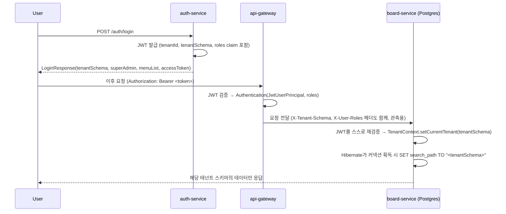

# 테넌트 스키마 라우팅 (로그인 → 스키마 전환 → SUPER_ADMIN)

이 문서는 로그인한 사용자의 요청이 실제로 자신이 속한 테넌트의 DB 스키마로 연결되는 전체 경로와, `ROLE_SUPER_ADMIN`이 테넌트와 무관하게 관리자 화면/데이터를 볼 수 있는 구조를 설명합니다. (구현: 2026-09-11, 브랜치 `claude/tenant-schema-login-routing-9bb451`)

## 1. 배경 — 무엇이 문제였나

`tenant-provisioning-worker`가 테넌트별로 실제 DB 스키마를 만들고([tenant-event-design.md](tenant-event-design.md)), 로그인 시 JWT에 `tenantId` claim이 들어가는 등 멀티테넌시의 "뼈대"는 이미 있었지만, 로그인 이후의 실제 요청이 그 테넌트 스키마로 연결되도록 만드는 배선은 끊겨 있었습니다.

- `common-jwt`의 `JwtAuthenticationHandler.createAuthentication()`이 토큰에서 뽑아낸 `tenantId`를 버리고, 권한도 무조건 `ROLE_USER`로 하드코딩했습니다. (자세한 배경은 [common-jwt-analysis.md](common-jwt-analysis.md) 참고)
- JWT에는 애초에 역할(`roles`)도, 실제 스키마명(`tenantSchema`)도 없었습니다 — `tenantId`는 `Tenant` 테이블의 숫자 PK일 뿐, 스키마명(`Tenant.name`)과는 다른 값입니다.
- `board-service`(실제 테넌트 업무 데이터가 들어가는 서비스)는 Spring Security 의존성도, Hibernate 멀티테넌시 설정도, 테넌트 스키마 안에 자기 테이블(`boards`)을 만들어주는 절차도 전혀 없었습니다. `application.yml`에 `jwt.secret`만 미리 설정되어 있고 실제로는 쓰이지 않고 있었습니다.
- `auth-service`의 `MenuService.getMenuListByUserInfo()`는 항상 사용자 자신의 테넌트에 활성화된 모듈만 조회했기 때문에, `ROLE_SUPER_ADMIN`도 테넌트와 무관하게 전체 관리 메뉴를 볼 방법이 없었습니다.

## 2. 전체 흐름



## 3. JWT — tenantSchema/roles claim 추가

`AuthService.issueLoginTokens()`가 로그인 시점에 `Tenant.name`(스키마명)과 사용자의 역할 목록을 JWT에 함께 실어 보냅니다.

```java
String tenantSchema = userDto.getTenant().getName(); // Postgres 스키마명, tenantId(PK)와는 다른 값
List<String> roles = userDto.getRoles().stream().map(RoleDto::getName).toList();
String accessToken = jwtTokenProvider.generateAccessToken(username, tenantId, tenantSchema, roles);
```

| Claim | 값 | 용도 |
| --- | --- | --- |
| `tenantId` | `Tenant.id` (숫자 PK) | auth-service 내부 FK 참조용 |
| `tenantSchema` | `Tenant.name` (스키마명) | **실제 스키마 라우팅에 사용** |
| `roles` | 로그인 시점 역할 목록 | 권한 부여, `ROLE_SUPER_ADMIN` 여부 판단 |

리프레시 토큰 재발급(`AuthService.refreshAccessToken`)과 OAuth 로그인(`OAuthLoginService`) 경로도 동일하게 최신 tenantSchema/roles를 다시 계산해 넣습니다 — DB에서 새로 조회한 값을 쓰므로, 로그인 이후 역할이 바뀌면 다음 토큰 재발급 시 반영됩니다.

## 4. common-jwt — 토큰 정보를 Authentication까지 실어 나르기

- `JwtAuthenticationContext`에 `tenantSchema`, `roles` 필드 추가.
- `JwtAuthenticationHandler.createAuthentication()`이 더 이상 `ROLE_USER`를 하드코딩하지 않고, 토큰의 `roles` claim으로 `GrantedAuthority`를 구성합니다. principal은 새 `JwtUserPrincipal`(`AuthenticatedPrincipal` 구현, `getName()`→username이라 기존 `authentication.getName()` 호출부는 그대로 동작).
- 신규 `com.common.jwt.tenant.TenantContext`: 현재 요청 스레드의 테넌트 스키마를 담는 `ThreadLocal`. `ServletJwtAuthenticationFilter`가 인증 성공 시 세팅하고, 요청이 끝나면 `SecurityContextHolder.clearContext()`와 함께 반드시 정리합니다.

## 5. api-gateway — 다운스트림 헤더 전파

`UserContextFilter`가 기존 `X-User-Id`에 더해, principal이 `JwtUserPrincipal`이면 `X-Tenant-Schema`, `X-User-Roles`(콤마 join) 헤더도 추가합니다. 이 헤더는 관측/로깅 목적이며, `board-service`는 아래처럼 JWT를 스스로 검증하므로 이 헤더를 신뢰 판단 기준으로 쓰지 않습니다.

## 6. board-service — 실제 스키마 전환 (Hibernate SCHEMA 멀티테넌시)

`board-service`는 이제 `auth-service`와 동일하게 자체 `JwtConfig`/`BoardSecurityConfig`로 JWT를 직접 검증합니다(게이트웨이 헤더를 맹신하지 않음). 인증에 성공하면 `TenantContext`에 담긴 스키마를 Hibernate가 커넥션 단위로 전환합니다.

- `com.microservices.board.tenant.TenantIdentifierResolver` (`CurrentTenantIdentifierResolver<String>`): `TenantContext.getCurrentTenant()`, 없으면 `"public"`.
- `com.microservices.board.tenant.SchemaMultiTenantConnectionProvider` (`MultiTenantConnectionProvider<String>`): 단일 `DataSource` 위에서 커넥션을 꺼낼 때마다 `SET search_path TO "<schema>", public`을 실행하고, 반납할 때 `SET search_path TO public`으로 되돌립니다. 스키마명은 `^[a-zA-Z0-9_]+$` 정규식으로 검증한 뒤에만 SQL에 사용합니다(SQL 인젝션 방지 — `tenant-provisioning-worker`의 `SchemaProvisioningService`와 동일한 검증 규칙).
- `com.microservices.board.tenant.HibernateMultiTenancyConfig`: 위 두 빈을 `HibernatePropertiesCustomizer`로 등록 (`AvailableSettings.MULTI_TENANT_CONNECTION_PROVIDER`, `AvailableSettings.MULTI_TENANT_IDENTIFIER_RESOLVER`).

`Board` 엔티티/리포지토리는 전혀 수정하지 않았습니다 — 스키마 기반 멀티테넌시는 커넥션의 `search_path`만 바꾸면 되므로, 엔티티에 `tenant_id` 판별 컬럼을 둘 필요가 없습니다.

### 6.1 새 테넌트 스키마에 `boards` 테이블 만들기

스키마만 있고 테이블이 없으면 조회/저장이 실패하므로, `board-service`도 `auth-service`가 발행하는 `tenant.created` 이벤트를 독립적으로 구독해 Flyway로 자기 테이블을 만듭니다. 자세한 내용은 [tenant-event-design.md](tenant-event-design.md) 9절 참고. 스키마-당-테넌트 구조에서는 검증할 단일 스키마가 없으므로, `ddl-auto`는 `docker`(Postgres) 프로파일에서 `none`으로 끕니다 — 로컬 `H2` 프로파일만 개발 편의상 `update`를 유지해 테넌트 스키마 없이도 기본(`public`) 스키마로 빠르게 구동/테스트할 수 있게 합니다.

## 7. ROLE_SUPER_ADMIN — 테넌트 무관 관리자 접근

**메뉴:** `auth-service`의 `MenuService.getMenuListByUserInfo(userId, isSuperAdmin)`는 `isSuperAdmin`이 `true`면 `qTenantModule`(테넌트별 모듈 활성화) 조인을 건너뛰고, 사용자의 역할에 부여된 메뉴 전체를 반환합니다. `AuthController.login()`이 로그인 응답의 `roles`에 `ROLE_SUPER_ADMIN`이 포함되어 있는지로 이 플래그를 계산하고, `LoginResponse.superAdmin`으로도 함께 내려줍니다.

**임의 테넌트 데이터 조회/전환:** `board-service`의 `com.microservices.board.security.SuperAdminTenantOverrideFilter`가 요청 헤더 `X-Target-Tenant-Schema`를 확인합니다. **인증된 `Authentication`의 권한에 실제로 `ROLE_SUPER_ADMIN`이 있을 때만** (헤더 값 자체는 신뢰하지 않고 서버가 직접 검증) `TenantContext`를 그 값으로 덮어써서, 본인의 테넌트가 아닌 다른 테넌트의 데이터를 조회할 수 있게 합니다. 일반 사용자가 이 헤더를 보내도 무시됩니다.

## 8. 확인된 한계 (이번 범위 밖, 의도적으로 남겨둠)

- **샤드 간 라우팅 없음:** `board-service`는 여전히 단일 `DataSource`(단일 shard)만 사용합니다. `Tenant.shardKey`가 여러 물리 DB를 모델링하고 있지만, 샤드 간 라우팅(`AbstractRoutingDataSource` 등)은 이번 작업에 포함하지 않았습니다.
- **로컬 H2 검증 한계:** 로컬 개발 프로파일은 테넌트 스키마 분리를 실제로 검증하지 않습니다(위 6.1 참고). 실제 스키마 분리는 `docker-compose.yml`의 Postgres 환경에서 확인해야 합니다.

## 9. 검증 방법

1. `./gradlew build` — `common-jwt`, `api-gateway`, `auth-service`, `board-service` 컴파일/테스트, `board-service`의 ArchUnit 아키텍처 규칙([archunit-rules.md](archunit-rules.md) 참고) 포함.
2. `docker-compose.yml`로 Postgres/RabbitMQ/전체 서비스 기동 후, 신규 테넌트 등록 → 스키마 및 `boards` 테이블 생성 확인(`psql`로 `\dn`, `SELECT * FROM <tenant>.boards`).
3. 일반 사용자 로그인 → `LoginResponse.tenantSchema` 확인 → 발급된 토큰으로 `/board` 호출 시 해당 테넌트 스키마에만 데이터가 쌓이는지, 다른 테넌트 사용자에게는 보이지 않는지 확인.
4. `ROLE_SUPER_ADMIN` 사용자 로그인 → `LoginResponse.superAdmin=true` 및 전체 관리 메뉴 확인 → `X-Target-Tenant-Schema` 헤더로 다른 테넌트 데이터 조회 성공, 일반 사용자는 같은 헤더를 보내도 무시되는지 확인.
