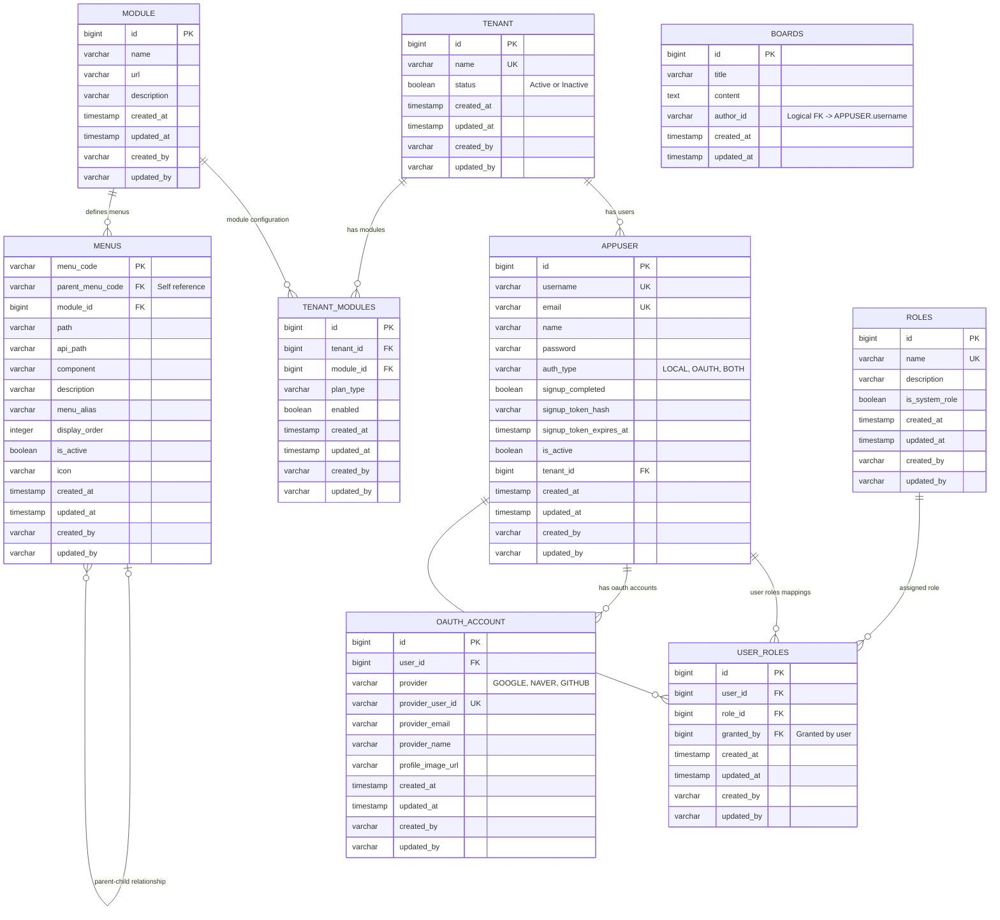

# Database ERD & Table Specifications

이 문서는 `micro-service` 프로젝트의 데이터베이스 관계 설계(ERD)와 테이블 정의를 설명합니다.

## 1. ERD (Entity Relationship Diagram)

---

## 2. 테이블 정의 요약

### Auth 서비스 (`auth-service`)
- **`tenant`**: 테넌트(고객사) 정보 테이블. 멀티테넌시(Multi-tenancy) 지원을 위해 `appuser` 및 `tenant_modules`가 이를 참조합니다.
- **`appuser`**: 사용자 정보 테이블. 특정 테넌트(`tenant_id`)에 속할 수 있습니다.
- **`roles`**: 사용자 역할(Role)을 관리하는 테이블 (예: `ROLE_ADMIN`, `ROLE_USER`).
- **`appuser_roles`**: 사용자와 역할 간의 다대다(N:M) 관계 매핑 테이블.
- **`oauth_account`**: 소셜 로그인 사용자를 위한 OAuth 연동 계정 테이블. `appuser`와 1:N 관계를 맺습니다.
- **`modules`**: 시스템의 대메뉴 또는 마이크로서비스 기능 단위 모듈.
- **`menus`**: 모듈 내부에서 사용할 수 있는 세부 메뉴 항목. 계층형 트리 구조(Self-Referencing `parent_menu_code`)를 가집니다.
- **`tenant_modules`**: 특정 테넌트가 활성화한 모듈과 해당 플랜 유형(`plan_type`)을 관리합니다.

### 게시판 서비스 (`board-service`)
- **`boards`**: 자유게시판 정보 테이블. `author_id`는 MSA 아키텍처 원칙에 따라 외래 키(FK) 제약 조건 없이 물리적으로 분리되어 있으며, 논리적으로 `appuser` 테이블의 사용자 계정명(`username`)과 결합됩니다.
